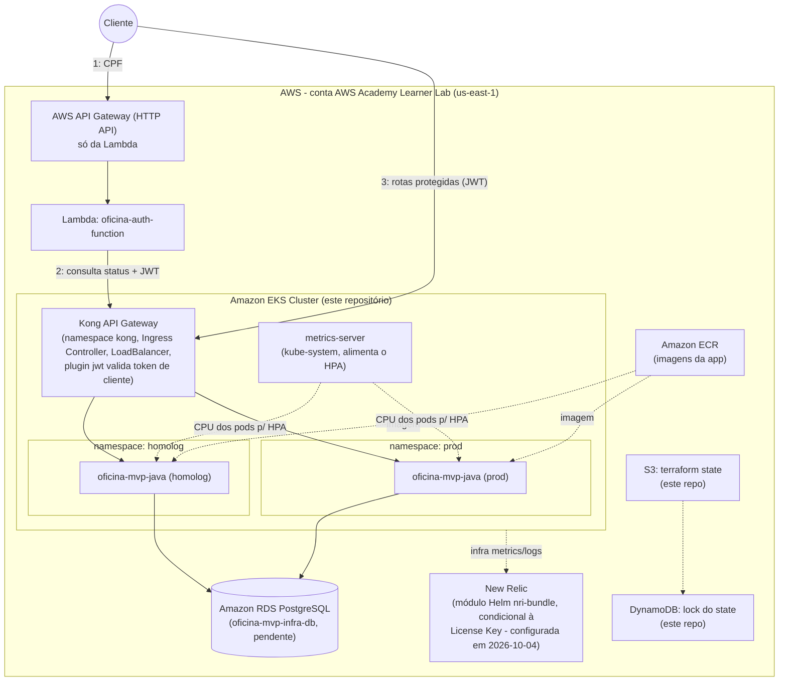

# 🛠️ Sistema de Gestão de Oficina Mecânica (Oficina MVP)
### Documentação de Arquitetura, Infraestrutura como Código e CI/CD

---

## 📌 1. Visão Geral do Projeto

O **Oficina MVP** é uma plataforma desenvolvida para automatizar e gerenciar o ciclo de vida completo de atendimentos de uma oficina mecânica. A solução abrange desde a recepção do veículo, geração e aprovação de orçamentos, alocação de mecânicos e execução dos serviços até o controle de inventário de peças e faturamento final.

A arquitetura foi projetada seguindo os princípios de **Domain-Driven Design (DDD)**, conteinerizada com **Docker**, orquestrada em **Amazon EKS (Kubernetes)** e provisionada via **Terraform** com pipelines de **GitHub Actions**.

Este repositório cuida de uma parte específica dessa infraestrutura — cluster EKS e repositório ECR. Ver
[Como este repositório se encaixa no projeto](#-4-como-este-repositório-se-encaixa-no-projeto) para o quadro
completo com os outros dois repositórios do desafio.

---

## 🏗️ 2. Infraestrutura como Código (IaC - Terraform)

### 2.1. Estrutura de arquivos

```text
oficina-mvp-infra-iac/
├── modules/
│   ├── ecr/
│   │   ├── main.tf              # Repositório Amazon ECR
│   │   ├── variables.tf         # Variáveis do módulo ECR
│   │   └── outputs.tf           # URL e ARN do repositório ECR
│   ├── eks/
│   │   ├── main.tf              # Cluster EKS e Managed Node Group
│   │   ├── variables.tf         # Variáveis do módulo EKS
│   │   └── outputs.tf           # Endpoints e Autoridade Certificadora
│   ├── kong/
│   │   ├── main.tf              # Helm release do Kong (namespace + helm_release)
│   │   ├── values.yaml          # Config do chart: DB-less, Ingress Controller, proxy LoadBalancer
│   │   ├── variables.tf         # Variáveis do módulo Kong
│   │   └── outputs.tf           # Namespace e nome do release
│   ├── metrics-server/
│   │   ├── main.tf              # Helm release do metrics-server (kube-system) - pré-requisito do HPA
│   │   ├── variables.tf         # Versão do chart
│   │   └── outputs.tf           # Nome do release
│   └── newrelic/
│       ├── main.tf              # Helm release do New Relic (nri-bundle) - infraestrutura + logs + kube-state-metrics
│       ├── variables.tf         # Variáveis do módulo New Relic
│       └── outputs.tf           # Namespace do release
├── backends.tf                  # Estado remoto do Terraform no S3
├── provider.tf                  # Configuração do provider (AWS ~> 5.0, kubernetes e helm)
├── data_source_vpc.tf           # Data sources: VPC default e subnets
├── data_source_iam.tf           # Data source: LabRole (IAM)
├── main.tf                      # Orquestração dos módulos
├── namespaces.tf                # Namespaces "homolog" e "prod" (separação de ambiente no mesmo cluster)
├── dynamodb.tf                  # Tabela DynamoDB de lock do state (bootstrap Fase 1, ver seção 2.4)
├── kong-jwt-auth.tf              # Consumer + credential + plugin JWT do Kong (valida o token de cliente, ADR-006)
├── variables.tf                 # Variáveis globais (com defaults)
├── outputs.tf                   # Saídas consolidadas do projeto
├── .github/workflows/
│   ├── create_iac.yml           # Pipeline de fmt/validate → plan → apply
│   └── destroy_iac.yml          # Pipeline manual de destroy
└── readme.md                    # Este arquivo
```

### 2.2. O que é provisionado

| Recurso | Módulo               | Detalhe                                                                 |
|---------|----------------------|--------------------------------------------------------------------------|
| ECR     | `modules/ecr`        | Repositório `oficina-mecnica-lab`, `scan_on_push` ativado, `force_delete = true` |
| EKS     | `modules/eks`        | Cluster `oficina-mecnica-lab-cluster` + managed node group (`t3.medium`, tamanho desejado 2, máximo 3) |
| Kong (API Gateway) | `modules/kong` | Helm release do Kong (`https://charts.konghq.com`) no namespace `kong`, modo **DB-less** (sem banco próprio) com **Ingress Controller** habilitado — as rotas vêm de recursos `Ingress` declarados no repositório da aplicação (`oficina-mvp-java`), não de configuração manual aqui |
| Namespaces `homolog`/`prod` | `namespaces.tf` | Separação de ambiente dentro do mesmo cluster EKS — a aplicação principal faz deploy no namespace correspondente à branch de origem (`homolog` ou `master`) |
| Tabela de lock do state | `dynamodb.tf` | `aws_dynamodb_table` (`PAY_PER_REQUEST`) para lock do backend S3 — ver seção 2.4 para o processo de bootstrap em 2 fases |
| Validação do JWT de cliente no Kong | `kong-jwt-auth.tf` | `KongConsumer` + `Secret` (credential JWT) + `KongClusterPlugin` (`jwt`) — o Kong valida assinatura/expiração do token de cliente (emitido pela Lambda) antes de rotear pra aplicação. Decisão em ADR-006 (`oficina-mvp-java-backend/docs/architecture/adrs/`) |
| metrics-server | `modules/metrics-server` | Helm release do chart oficial (`kubernetes-sigs`, `3.14.0`) no `kube-system`. **Pré-requisito do HPA** da aplicação: o EKS não vem com metrics-server, e sem ele o HPA fica com `cpu: <unknown>` e nunca escala. Via Helm (e não add-on do EKS) porque o Learner Lab nega a API de add-ons |
| New Relic (observabilidade) | `modules/newrelic` | Helm release `nri-bundle` (infraestrutura + kube-state-metrics + logs) — **só instalado se `var.new_relic_license_key` não estiver vazia** (`count`); sem License Key configurada, nada é criado |

Usa a **VPC default** da conta e a role `LabRole` (fornecida pelo ambiente de laboratório) — não cria nenhuma IAM
role própria.

### 2.3. Ambiente: AWS Academy / Vocareum Learner Lab

Este Terraform foi escrito para rodar numa conta de **laboratório de aprendizado (AWS Academy Learner Lab)**, não
numa conta AWS convencional. Isso molda várias decisões do código:

- As credenciais são **temporárias** (access key + secret key + **session token**) e expiram em poucas horas —
  precisam ser atualizadas manualmente nos secrets do GitHub (`AWS_ACCESS_KEY_ID`, `AWS_SECRET_ACCESS_KEY`,
  `AWS_SESSION_TOKEN`) sempre que a sessão do lab é renovada.
- Não é possível criar roles/policies IAM próprias — cluster e node group reutilizam a `LabRole` já existente na
  conta (`data_source_iam.tf`), em vez de uma role dedicada com o princípio de menor privilégio.
- Usa a VPC default da conta (`data_source_vpc.tf`), filtrando as subnets para excluir a zona `us-east-1e`
  (incompatível com os tipos de instância usados pelo node group nesse ambiente).
- `force_delete = true` no ECR existe para facilitar destruir/recriar o ambiente repetidamente durante o
  desenvolvimento — não é uma configuração recomendada para produção.

### 2.4. State remoto

O state fica no S3 (`backends.tf`): bucket `oficina-mvp-tfstate-536036031274`, key `oficina-lab/terraform.tfstate`,
`encrypt = true`.

O bucket **não é criado pelo Terraform** (o backend precisa dele antes do `init`): é criado uma única vez pela
CLI na conta do Learner Lab, privado, versionado e criptografado. O sufixo é o ID da conta AWS, porque nomes de
bucket são globais — o nome antigo (`oficina-mvp-infra-iac`) pertence a outra conta e não pode mais ser usado.

```bash
B=oficina-mvp-tfstate-536036031274
aws s3api create-bucket --bucket $B --region us-east-1
aws s3api put-bucket-versioning --bucket $B --versioning-configuration Status=Enabled
aws s3api put-public-access-block --bucket $B --public-access-block-configuration \
  BlockPublicAcls=true,IgnorePublicAcls=true,BlockPublicPolicy=true,RestrictPublicBuckets=true
aws s3api put-bucket-encryption --bucket $B \
  --server-side-encryption-configuration '{"Rules":[{"ApplyServerSideEncryptionByDefault":{"SSEAlgorithm":"AES256"}}]}'
```

🟡 **Lock do state em bootstrap (2 fases)** — decisão fechada: manter S3 e adicionar lock via DynamoDB (em vez
de migrar para Terraform Cloud).
- **Fase 1 (feita neste repositório)**: `dynamodb.tf` cria a tabela `oficina-mvp-infra-iac-tf-lock`, usando
  ainda o backend atual (sem lock) para não travar antes da tabela existir.
- **Fase 2 (manual, depois que a Fase 1 aplicar com sucesso)**: adicionar
  `dynamodb_table = "oficina-mvp-infra-iac-tf-lock"` em `backends.tf` e rodar `terraform init -migrate-state`.
  Só faz sentido depois que a tabela já existir de fato na conta — por isso não entra no mesmo commit/PR da
  Fase 1. Até lá, evitar rodar `apply` em paralelo (manual + pipeline ao mesmo tempo).

### 2.5. Variáveis

| Variável       | Default               | Descrição                                              |
|-----------------|------------------------|-----------------------------------------------------------|
| `aws_region`    | `us-east-1`            | Região AWS onde tudo é provisionado                        |
| `project_name`  | `oficina-mecnica-lab`  | Nome base usado no ECR e no cluster (`<project_name>-cluster`) |
| `environment`   | `lab`                  | Ambiente, usado só como tag (`common_tags`)                |
| `customer_jwt_secret` | *(obrigatória, sem default)* | Segredo do JWT de cliente — mesmo valor de `oficina-auth-function`/`oficina-mvp-java-backend` (ADR-006) |
| `customer_jwt_issuer` | `customer-app`         | Claim `iss` do JWT / username do `KongConsumer`             |
| `new_relic_license_key` | *(vazia)*            | License Key da conta New Relic — vazia = módulo `newrelic` não é instalado |

Não há arquivo `terraform.tfvars` — os valores acima são os defaults declarados direto em `variables.tf`; para
sobrescrever, passar `-var` na linha de comando ou criar um `terraform.tfvars` local (ignorado pelo Git).

### 2.6. Outputs

| Output                       | Descrição                       |
|-------------------------------|-------------------------------------|
| `ecr_repository_url`         | URL do repositório ECR              |
| `eks_cluster_name`           | Nome do cluster EKS                 |
| `eks_cluster_endpoint`       | Endpoint da API do cluster EKS      |
| `kong_namespace`             | Namespace onde o Kong (API Gateway) foi instalado |
| `homolog_namespace`          | Namespace de homologação (deploy da aplicação principal) |
| `prod_namespace`             | Namespace de produção (deploy da aplicação principal) |
| `terraform_lock_table_name`  | Nome da tabela DynamoDB de lock do state (ver seção 2.4, Fase 2) |
| `customer_jwt_kong_plugin_name` | Nome do `KongClusterPlugin` de validação do JWT de cliente (`customer-jwt-auth`, ADR-006) |
| `newrelic_namespace` | Namespace do New Relic, se instalado (`null` quando sem License Key configurada) |

### 2.7. Como rodar localmente

Pré-requisitos: Terraform `>= 1.5.0`, credenciais AWS ativas (no caso do AWS Academy Learner Lab: access key +
secret key + **session token**, temporárias e válidas por poucas horas), `kubectl` (opcional, para inspecionar
o cluster depois).

```bash
# 1. Exportar credenciais AWS da sessão atual do lab
export AWS_ACCESS_KEY_ID="..."
export AWS_SECRET_ACCESS_KEY="..."
export AWS_SESSION_TOKEN="..."
export AWS_DEFAULT_REGION="us-east-1"
export TF_VAR_customer_jwt_secret="..."   # mesmo valor de oficina-auth-function/oficina-mvp-java-backend

# 2. Inicializar o backend remoto (S3)
terraform init

# 3. Ver o que seria criado/alterado
terraform plan

# 4. Aplicar
terraform apply

# 5. (opcional) Configurar o kubectl local para apontar para o cluster criado
aws eks update-kubeconfig --name "$(terraform output -raw eks_cluster_name)" --region us-east-1
kubectl get namespaces   # deve listar "homolog" e "prod" além dos padrão
kubectl get pods -n kong # deve mostrar o Kong rodando
```

Para desfazer tudo: `terraform destroy` (ou disparar manualmente o workflow `destroy_iac.yml` no GitHub).

### 2.5. Tags dos recursos (o que é cada coisa no console)

Todo recurso AWS criado por este repositório leva as **tags comuns do projeto** (`default_tags` do provider):
`Project=oficina-mvp` (igual nos 3 repos de Terraform), `Repository=oficina-mvp-infra-iac`, `Component=kubernetes`,
`Environment=lab`, `ManagedBy=terraform`, `Course=FIAP POSTECH 13SOAT - Tech Challenge Fase 3`. Além delas,
cada recurso tem **`Name`** (o que aparece na coluna *Name* do console) e **`Description`**:

| `Name` | Recurso | `Description` |
|---|---|---|
| `oficina-mvp-eks` | Cluster EKS | Cluster Kubernetes que roda o Kong e a aplicação (namespaces homolog/prod) |
| `oficina-mvp-eks-nodes` | Node group | Grupo de máquinas (EC2) do cluster EKS |
| `oficina-mvp-eks-node` | **Instâncias EC2** dos nós | Máquina worker do cluster (via `aws_launch_template`: as tags do node group não passam para as instâncias) |
| `oficina-mvp-eks-node-disk` | Discos (EBS) dos nós | Disco da máquina worker |
| `oficina-mvp-ecr` | ECR | Imagens Docker da aplicação Java |
| `oficina-mvp-tf-lock` | DynamoDB | Lock do state do Terraform |
| `oficina-mvp-kong-lb` | **Load Balancer do Kong** | Entrada pública da aplicação. Criado pelo Kubernetes, etiquetado pela annotation `aws-load-balancer-additional-resource-tags` em `modules/kong/values.yaml` |

Para ver **todos** os recursos do projeto numa tela só: console AWS → **Resource Groups & Tag Editor → Tag Editor**
→ Region `us-east-1`, Resource types `All supported`, Tag `Project` = `oficina-mvp` → *Search resources*.
Os nomes técnicos (`oficina-mecnica-lab-...`, com o erro de digitação histórico) foram mantidos para não recriar
recursos nem quebrar pipelines; a tag `Name` é o nome legível.

## ⚙️ 3. CI/CD (GitHub Actions)

Dois workflows, ambos exigindo os secrets `AWS_ACCESS_KEY_ID` / `AWS_SECRET_ACCESS_KEY` / `AWS_SESSION_TOKEN` /
`CUSTOMER_JWT_SECRET` (esse último **precisa ser idêntico** ao configurado em `oficina-auth-function` e
`oficina-mvp-java-backend`, ver ADR-006) e a variável `AWS_DEFAULT_REGION` (configurados em 2026-10-04; os 3
secrets AWS expiram a cada sessão do Learner Lab e precisam ser regravados). Secret **opcional**:
`NEW_RELIC_LICENSE_KEY` — se ausente/vazio, o módulo `newrelic` simplesmente não é instalado (sem erro).

- **`create_iac.yml`** — três jobs em cadeia: `fmt-validate` (`terraform fmt -check` + `terraform validate`, com
  `init -backend=false` — não usa credenciais AWS, roda mesmo com o Lab desligado) →
  `plan` → `apply` (este último só roda em push para `homolog` ou `master`, ou disparo manual nessas branches).
  Gatilhos de `pull_request`/`push` cobrem `homolog` e `master`, seguindo o git flow do projeto
  (`feat/* → homolog → master`) — corrigido em 2026-09-26 (antes apontavam para uma branch `main-disabled`
  inexistente, então só rodava manualmente).
- **`destroy_iac.yml`** — só dispara manualmente (`workflow_dispatch`), roda `terraform destroy -auto-approve`.

**Chave de deploy — variable `DEPLOY_ENABLED`** (o crédito do AWS Academy é limitado; detalhe em
`plans/10-chave-deploy-enabled.md` no repositório de specs):
- `true` → em push para `homolog`/`master`, executa automaticamente `plan` e `apply` (deploy automático de homologação e
  produção, como pede o enunciado).
- `false` ou ausente → o pipeline roda só o que não depende da AWS e **pula** (*skipped*) `plan` e `apply`. É o estado
  padrão fora de uma janela de deploy, para um merge não subir recursos pagos.
- **Disparo manual** (*Actions → Run workflow*) ignora a chave: rodar pelo botão já é uma decisão explícita.
- Ligar/desligar: *Settings → Secrets and variables → Actions → Variables → `DEPLOY_ENABLED`*.

## 🧩 4. Como este repositório se encaixa no projeto

Este é o repositório de infraestrutura Kubernetes (EKS + ECR + Kong) do desafio — repositório 2 dos 4 exigidos
pelo enunciado. Os outros três:

- [`oficina-mvp-infra-db`](https://github.com/lukebria/oficina-mvp-infra-db) — infraestrutura do banco de dados
  gerenciado (PostgreSQL via Amazon RDS, Terraform), repositório 3/4. Criado em 2026-09-26, ainda sem o
  Terraform do RDS (ver `plans/01-infra-db-novo-repo.md`). Vai consumir `vpc_id`/subnets deste repositório via
  `terraform_remote_state` para liberar acesso do RDS ao cluster EKS.
- [`oficina-mvp-java`](https://github.com/lukebria/oficina-mvp-java) — backend Spring Boot, repositório 4/4. O
  `.github/workflows/app-deploy.yml` de lá assume que o cluster (`oficina-mecnica-lab-cluster`), o repositório
  ECR (`oficina-mecnica-lab`) e o Kong (namespace `kong`) provisionados aqui já existem, e aplica os manifests em
  `k8s/` sobre eles — incluindo o `Ingress` que conecta a aplicação ao Kong (`k8s/ingress.yaml`) e o Postgres,
  que hoje roda como um `Deployment` comum dentro do mesmo cluster (`k8s/banco.yaml`), e **não** é um banco
  gerenciado provisionado por este Terraform.
- [`oficina-auth-function`](https://github.com/lukebria/oficina-auth-function) — Function serverless (Lambda) que
  valida CPF/CNPJ e emite o JWT do fluxo público de cliente. Não depende de nada provisionado aqui — tem seu
  próprio Terraform (Lambda + API Gateway) dentro do próprio repositório. É um **API Gateway distinto do Kong**:
  cada serviço (Lambda vs. aplicação principal no EKS) tem o seu.

### Kong (API Gateway da aplicação principal)

O `modules/kong` sobe o Kong via Helm (`https://charts.konghq.com`) dentro do próprio cluster EKS, sem nenhum
serviço gerenciado novo/billável:

- **Modo DB-less** (`env.database: "off"`) — sem Postgres/Cassandra próprio pro Kong, mais barato e mais simples
  de operar num ambiente de crédito de lab.
- **Ingress Controller habilitado** (`ingressController.enabled: true`) — o Kong descobre as rotas lendo
  recursos `Ingress` padrão do Kubernetes; ele não tem nenhuma rota "hardcoded" aqui. Quem declara o `Ingress` é
  o repositório da aplicação (`oficina-mvp-java/k8s/ingress.yaml`), com `ingressClassName: kong`.
- **`proxy.type: LoadBalancer`** — o Kong ganha seu próprio endereço público (ELB da AWS); o `Service` da
  aplicação principal passou a ser `ClusterIP` (só acessível de dentro do cluster), porque quem recebe tráfego
  externo agora é o Kong.
- Autenticação dos providers `kubernetes`/`helm` (`provider.tf`) usa os outputs do módulo `eks`
  (`cluster_endpoint`, `cluster_certificate_authority_data`) + `data "aws_eks_cluster_auth"` — reaproveita as
  mesmas credenciais AWS (temporárias, do Learner Lab) já usadas pelo provider `aws`.

### Validação do JWT de cliente no Kong (ADR-006)

`kong-jwt-auth.tf` configura o plugin `jwt` nativo do Kong para validar o token do fluxo público de cliente
(emitido pela Lambda `oficina-auth-function`) **antes** da requisição chegar na aplicação principal — defesa em
profundidade: a aplicação continua validando o token e revalidando o status do cliente no banco, nada foi
removido do lado dela.

- `KongConsumer` (`username` = `var.customer_jwt_issuer`, default `customer-app`) + `Secret` rotulado
  `kongCredType: jwt` com a credencial (mesmo `CUSTOMER_JWT_SECRET` usado pela Lambda e pela aplicação).
- `KongClusterPlugin` (`customer-jwt-auth`) — cluster-scoped para poder ser referenciado por `Ingress` em
  qualquer namespace (`homolog`/`prod`) via a anotação `konghq.com/plugins: customer-jwt-auth`.
- Só se aplica às rotas públicas de OS — ver `oficina-mvp-java-backend/k8s/ingress-public.yaml` (`Ingress`
  dedicado, separado do `Ingress` geral da aplicação).
- **Entregue pelo próprio Helm release do Kong** (`extraObjects` do chart, via `module.kong`): o Helm instala
  primeiro os CRDs `KongConsumer`/`KongClusterPlugin` e depois estes objetos, na mesma `apply`. Antes eles eram
  `kubernetes_manifest`, que exige o cluster já existir no momento do `plan` — num ambiente do zero o plan
  inteiro falhava (`Failed to construct REST client`) e nada era criado.

Os 4 repositórios exigidos pelo enunciado já existem (Lambda, infra Kubernetes — este —, infra de banco
gerenciado, aplicação principal); o repositório de banco (`oficina-mvp-infra-db`) ainda está vazio, aguardando
o Terraform do RDS.

## 🖼️ 5. Diagrama

### 5.1. Diagrama de componentes (atualizado em 2026-10-04)



> Este diagrama substitui, para fins de arquitetura atual, o PNG legado abaixo — cobre Kong, os 2 gateways
> distintos (Kong vs. AWS API Gateway da Lambda), os namespaces homolog/prod, e o RDS (ainda pendente de
> aplicar). Ver `plans/06-documentacao-arquitetural.md` no repositório de specs do projeto para o diagrama de
> componentes definitivo (cobrindo também observabilidade).

### 5.2. Diagrama legado (histórico, desatualizado)


> O diagrama mostra "Terraform Cloud" como backend do state — o backend real hoje é S3 (ver
> [State remoto](#24-state-remoto)). O repositório `oficina-mvp-java-backend` no diagrama corresponde ao
> repositório atual `oficina-mvp-java`, e a function `oficina-auth-function` ainda não está representada aqui.
